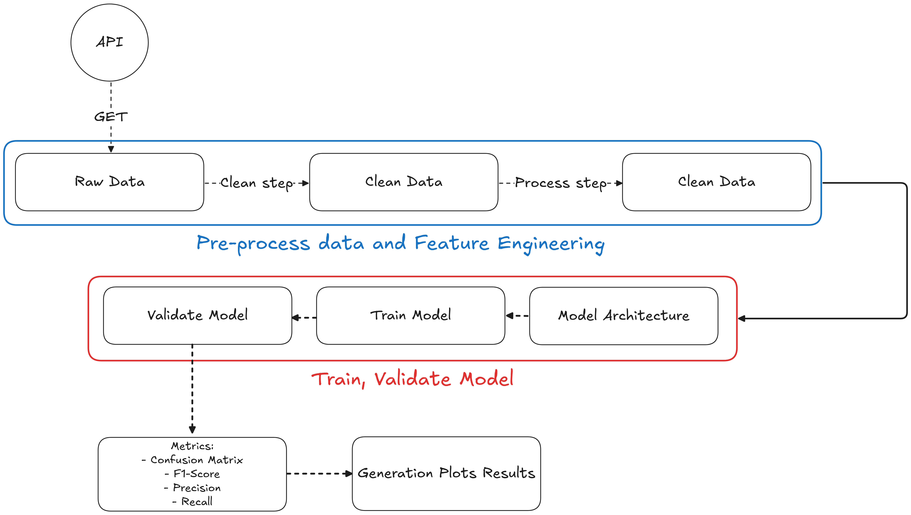

A pipeline da solução pode ser exemplificada através da seguinte imagem:

### Etapas obrigatórias concluidas:
1. **[ X ] Aquisição e Pré-processamento de Dados**: Automatizar o download dos dados da NHTSA. Realizar o pré-processamento necessário, incluindo limpeza de texto (remoção de caracteres especiais, tratamento de stop words, stemming ou lematização), e transformação em um formato adequado para o treinamento do modelo. Documentar todas as etapas e justificar as escolhas realizadas.

2. **[ X ] Engenharia de Features**: Criar recursos relevantes a partir do texto das reclamações. Isso pode incluir, mas não se limita a: embeddings de palavras ou sentenças, word count, TF-IDF, n-grams, sentimento, tópicos extraídos via LDA ou modelos similares. Documentar o processo e a escolha dos recursos.

3. **[ X ] Treinamento do Modelo**: Treinar um modelo usando as features criadas. Justificar a escolha do modelo e da arquitetura (se aplicável), considerando as características dos dados e a tarefa de classificação/Clusterização/Regressão escolhida. Monitorar o treinamento e registrar métricas relevantes (precisão, recall, F1-score, AUC, etc.) para avaliar a performance do modelo.

4. **[ ] Deploy e Versionamento**: Implementar o deploy do modelo treinado utilizando ferramentas de versionamento de código (como Git) e gerenciamento de pacotes (como pip ou conda). A solução deve ser facilmente reproduzível.

5. **[ X ] Relatório e Análise Estatística**: Gerar um relatório conciso que inclua:
    - Descrição (ou desenho (desenho conta mais kkk)) da pipeline de processamento de dados.
    - Análise estatística descritiva dos dados, com gráficos relevantes (histogramas, boxplots, etc.) e comentários interpretando os resultados, não vale só plotar graficozinho.
    - Detalhes sobre o modelo escolhido, incluindo a arquitetura (se aplicável) e justificativa para a sua escolha.
    - Resultados do treinamento, incluindo as métricas de avaliação e uma análise da performance do modelo.
    - Discussão sobre os pontos fortes e fracos da solução.